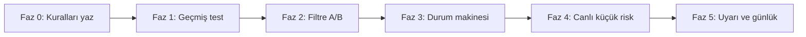

# CRT stratejisi — yol haritası ve dokümantasyon

Bu belge, **Candle Range Theory (CRT)** çekirdeğini (Referans → Sweep → Onay) ölçülebilir ve sürdürülebilir şekilde geliştirmek için önerilen fazları ve senden beklenen net girdileri içerir.

---

## 1. Strateji özeti (tek sayfa)

| Kavram | Tanım |
|--------|--------|
| **R (Referans)** | Karar aralığı: önceki mumun `CRT-High` / `CRT-Low` (veya tanımladığın referans mum). |
| **S (Sweep)** | Fiyatın referans aralığının dışına çıkarak likidite alması (üst veya alt). |
| **O (Onay)** | Sweep sonrası fiyatın aralığa dönüş veya senaryona göre **kapanışla** yönün netleşmesi. |
| **Sweep var, onay yok** | Tabloda genelde **SWEEP / PEND** — tam pozisyon için onay beklenir. |
| **CRT gövde %50** | Sweep mumunun gövde ortası; geri çekilme / limit bölgesi referansı. |

**Invalidasyon:** Karşı yönde güçlü kapanış veya sweep mantığının bozulması (kurallarını yazılı netleştir).

---

## 1A. Kanonik CRT anlayışı (senin metin + görseller)

Bu bölüm, paylaştığın tanımı ve örnek grafiklerdeki (EUR/USD 4H–5m, USD/CAD 4H–5m) mantığı **tek çatı altında** özetler. Amaç: otomasyon ve çoklu TF taraması için ortak dil.

### Mum aralığı nedir?

- **Yüksek zaman dilimindeki (HTF) her mum**, daha düşük zaman dilimlerinde (LTF) bir **fiyat aralığının** üstünü ve altını çizer.
- O mumun **High** değeri → **CRT-High** (LTF’de bu aralığın üst sınırı).
- O mumun **Low** değeri → **CRT-Low** (alt sınır).

Yani CRT-High/Low, “önceki referans mumun” matematiksel aralığıdır; stratejide genelde **destek/direnç, OB veya önemli bölge ile birlikte** seçilir (görsellerde 4H OB + FVG altında süpürme gibi).

### CRT’nin çekirdek beklentisi (likidite sırası)

CRT çerçevesinde, aralık içindeki likidite genelde **bir sonraki likidite hedefine gitmeden önce** alınır (süpürülür):

- Fiyat **önceki mumun altındaki** likiditeyi süpürürse → hareketin **üst tarafa** (ör. CRT-High / üst likidite) yönelmesi beklenir.
- **Tersi:** Üstteki likidite süpürülürse → **alt tarafa** (ör. CRT-Low / alt likidite) yönelim beklenir.

Bu, tablodaki R–S–O zincirinin **neden** sweep’ten sonra yön aradığını açıklar.

### PO3 (Üçüncü Güç) ile ilişki

Aynı fiyat hareketi, LTF’de çoğu zaman **Toplanma → Manipülasyon → Dağıtım** olarak okunur:

| Aşama | Rol (özet) |
|--------|------------|
| **Toplanma** | Aralık / yatay yapı; likidite birikir. |
| **Manipülasyon** | Aralık dışı süpürme (sahte kırılım); CRT’de “S” aşamasına denk gelir. |
| **Dağıtım** | Asıl trend yönünde genişleme; hedefe gidiş (“O” ve sonrası). |

Görsellerde bu üçü **5m** üzerinde dikey bölünmüş; HTF’de ise tek mumun içinde bu fazlar “iç içe” görünür.

---

### Boğa CRT modeli (metnine göre adımlar)

**Bağlam:** Fiyat HTF’de **önemli bir destek**e gelir; referans, destekte **kapanan** mumun High/Low ile çizilir (CRT-High / CRT-Low).

1. **Sweep (alt likidite):** Sonraki gelişimde fiyatın **aralığın altındaki** likiditeyi süpürmesi.
2. **İlk onay:** **Önceki (referans) mumun üzerinde** kapanış (metinde açıkça: bir önceki mumun üzerinde kapanış).
3. **İkinci onay (bir seçenek):**  
   - Ya başka bir mumun **süpürme mumunun üzerinde** kapanması,  
   - Ya da **daha düşük TF’de ICT yapı değişimi (MSS)** aranması.
4. **Giriş:** Fiyatın geri çekilmesinde (pullback) alış; görsellerde bu genelde **LTF FVG** veya OB tekrar testi ile gösteriliyor.

**Ayı CRT (görsellerle simetrik):** Dirençte referans mum çizilir → sonraki mum **CRT-High üstüne** likidite süpürür → ardından **CRT-Low altında** kapanış / yapı bozulması ile aşağı senaryo teyidi (USD/CAD 4H örneği). LTF’de yine PO3: üstte süpürme → MSS aşağı → FVG’den satış.

---

### Zengin strateji katmanları (farklı örneklerle genişleme)

Aynı çekirdek kurallar, aşağıdaki **varyasyonlarla** zenginleştirilebilir (hepsini aynı anda zorunlu tutma; önce birini ölç):

| Katman | Ne ekler? | Örnek |
|--------|-----------|--------|
| **HTF bağlam** | Referans mum nerede kapanıyor? | Sadece 4H OB/FVG yakınındaki CRT |
| **Çoklu TF** | HTF aralık + LTF süpürme/onay | 4H CRT-High/Low, tetik 15m/5m |
| **MSS (LTF)** | Manipülasyon sonrası yapı kırılımı | 5m’de swing high/low kırılımı |
| **FVG giriş** | Dağıtım sonrası geri çekilme bölgesi | MSS sonrası oluşan boşluk |
| **Çoklu periyot tarama** | Her sembolde 1m…1D sırası | Otomasyon; kota ve gürültü yönetimi şart |

---

### Mevcut `CRT_futures_scanner_v2.html` ile fark

| Konu | Şu anki dosya (özet) | Senin anlattığın tam model |
|------|----------------------|----------------------------|
| Referans | Genelde **t-2** mumu sabit üçlü | Destek/direnç **bağlamı** ile seçilen mum |
| Onay | **t** kapanışı ile matematiksel kurallar | Metin: önce ref üstü kapanış, sonra ek onay veya **LTF MSS** |
| Giriş | Giriş fiyatı formül ile | **Pullback + FVG/OB** (LTF) |
| PO3 | Kısmen metin panelde | Grafikteki gibi **LTF fazları** ayrı state olarak yok |

İleride “zengin strateji” için yol: önce **HTF referans seçim kuralını** (sadece OB yakını mı, her mum mu) netleştirmek, sonra **LTF MSS + FVG** için ikinci bir modül eklemek; en son **tüm TF otomatik tarama** (kuyruk + hız limiti).

---

*Referans görseller: EUR/USD ve USD/CAD (4H + 5m PO3), boğa/ayı CRT — Cursor oturumunda `assets` altına kayıtlı PNG dosyaları.*

---

## 1B. Yüksek olasılıklı CRT kurulumları (oturum + desen)

Aşağıdaki maddeler, paylaştığın metne göre **filtre** katmanıdır: tek başına strateji değil; CRT + likidite + PO3 anlayışıyla **sistematik** seçim için kullanılır.

### Öldürme bölgesi / oturum odağı

Tüccarlar likidite süpürmelerini, mümkünse **yüksek etkili oturum** pencereleriyle hizalar. Metinde geçen saatler **EST** (Doğu ABD):

| Oturum | Yerel saat (EST) | Rol (metne göre) |
|--------|------------------|------------------|
| **Asya** | (aralık metinde sayı yok; genelde Asya) | Düşük volatilite; **toplanma** aşaması |
| **Londra** | 03:00 – 06:00 | **Manipülasyon** (süpürme) sık görülür |
| **New York** | 08:30 – 11:30 | **Dağıtım** (asıl yön genişlemesi) |

**Uygulama notu:** Kripto 7/24 işler; forex/metalde bu pencereler daha anlamlı. Kodda saatler **UTC’ye çevrilmeli** (mevcut HTML `getSessionTagUTC()` ile uyum için EST→UTC ofseti net tanımlanmalı). “Öldürme bölgesi” = bu Londra/NY pencerelerinde süpürme aramak.

### Geçerli likidite süpürmesi için sinyal kriterleri

1. **Üçlü mum:** İkinci mum likiditeyi **süpürür**; üçüncü mum **ikinci mumun üzerine** kırar (metindeki ifade; ayı senaryosunda simetrik olarak “altına kırım” tanımı eklenebilir).
2. **Süre:** Desenin **15 dakikadan kısa** sürede oluşması gerekir (duvar saati: üç mumun toplam süresi ≤ 15 dk). Örnek: **5m** TF’de arka arkaya 3 mum = tam 15 dk → sınırda; **1m** TF’de en fazla 15 mumluk pencere ile kontrol edilir.
3. **Süpürme sonrası reddetme:** Fiyatın süpürmeden sonra **reddi** (ör. **yapı değişimi / MSS**) “kurumsal ilgi” filtresi olarak kullanılır.

### ICT PO3 ile CRT hizası

| PO3 (ICT) | CRT ile karşılık |
|-----------|------------------|
| Toplanma | Fiyat önce bir aralıkta toplanır |
| Manipülasyon | **CRT-High/Low** likiditesi **süpürülür** |
| Dağıtım | Ters yönde **dağıtım** (hedefe gidiş) |

**CRT-High/Low** sadece “bir önceki mum” olmayabilir; **önceki günün** veya **oturumun** yüksek/düşük seviyelerine de hizalanabilir. Otomasyonda referans seviye kaynağı: `önceki mum` | `önceki gün H/L` | `oturum H/L` seçenekleri ayrı parametre olmalı.

### Sonuç (metnin özü)

CRT başlı başına tek başına “her şey” değil; **likidite süpürmesi + Üçüncü Güç** bilgisiyle birleştirildiğinde, **yüksek olasılıklı** kurulumlar daha sistematik seçilir. Büyük hareketlerle hizalanma + **disiplinli risk** birlikte düşünülür.

---

## 1C. Görsel eğitim seti — birleşik strateji (Turtle Soup, bias, CISD, SMT)

Aşağıdaki tablo, paylaştığın **tüm görsellerdeki** mum davranışı ve metinleri **tek strateji diline** indirger. Amaç: mevcut `computeCRT` motorunu genişletirken öncelik sırası.

### Kavram sözlüğü (görseller ↔ CRT)

| Görseldeki isim | Stratejideki rol |
|-----------------|------------------|
| **Turtle Soup** | Eski high/low üstünden/altından **sahte kırılım** — likidite süpürme; CRT’de **manipülasyon (S)** ile aynı aile. |
| **Kiss Of Death (KOD)** | Ana hareket öncesi **ikinci, genelde daha küçük** bir sweep / tuzak; “son bir likidite alımı” — kodda ayrı bayrak (ileri faz). |
| **CRH / CRL** | CRT-High / CRT-Low (referans aralığı). |
| **Bias (HTF)** | Aylık/haftalık/günlükte **önceki mumun high’ının üstünde** veya **low’unun altında** kapanış ile yön öngörüsü; hedef olarak **kıran mumun** uçları. |
| **Bias değişimi** | Art arda yeni high/low kıramama; “içeride kapanış” / yapı bozulması — trend sürekliliği biter, **ters likidite** hedefi güçlenir. |
| **CISD** | Teslimat durumu değişimi: ör. ayıda son tepeyi yapan serideki **ilk mumun açılışının altına** kapanış (metindeki tanım); **4H yapı + 15m tetik** örneği. |
| **IFVG** | FVG’nin “ters tarafa” kırılıp kapanması — **teyit** veya erken giriş filtresi. |
| **0.62 (manipülasyon mumu)** | Sweep mumunu gövde/fitil ile tanımlayıp **Fib 0.62** geri çekilme girişi (mevcut kodda `%50` ile aynı fikir ailesi; 0.62 ayrı parametre olabilir). |
| **SMT** | İki korelasyonlu enstrümanda (EUR/USD vs GBP/USD, altın vs gümüş vb.) **birinde HH, diğerinde LH** gibi uyumsuzluk — **teyit**; tek başına giriş sinyali değil. |

### PO3 ve görseller (tekrar, uygulama diliyle)

1. **Toplanma (konsolidasyon):** Yatay bant; likidite iki uçta birikir — Asya / düşük vol ile uyumlu.  
2. **Manipülasyon:** Range high/low **fitille ihlal**, gövde çoğu zaman **içeri** veya ters yönde — Turtle Soup.  
3. **Dağıtım:** Kırılımı takip eden trader likiditesi kullanılarak **asıl yön** — genelde **3. mum** veya LTF CISD + FVG.  

### HTF bias kuralları (görsellerdeki “nasıl bias?”)

- **Bullish bias (özet):** Son kapanış, önceki mumun **high üstünde** ise yükselişin devamı beklenir; **hedef** olarak kıran mumun **high**’ı (sonraki mumda likidite).  
- **Bearish bias (özet):** Kapanış önceki mumun **low altında** ise düşüş devamı; hedef **low** tarafı.  
- **Bias değişimi:** Önceki mumun high’ını alamama veya low’unu kıramama; “hedef” artık **tepki veremeyen mumun** karşı ucu (likidite).  

**Uygulama notu:** Mevcut `computeWeeklyBiasFromWeekly` / günlük bias ile uyumlu; görseldeki kural **daha net mum-kıyas** (close vs prev H/L) — motoru zenginleştirmek için ayrı fonksiyon: `biasFromPrevCandleHLC(candles)`.

### Ayı CRT (görsellerdeki zorunlu bağlam)

- **HTF bias ile ters** CRT kurulumları (ör. günlük bull iken 4H bear CRT) **daha sık başarısız** olabilir; tabloda **W·D stack** ile uyum filtresi.  
- Manipülasyon **önemli seviyede** (FVG, swing, OB, breaker vb.) olmalı — tam otomasyon için “seviye” önce proxy (FVG + swing) ile başlanır.  
- **SL:** Manipülasyon sweep’inin **ucunun ötesi** (üstteki high).  
- **TP / yönetim:** Aralığın **%50 denge** (equilibrium) — kısmi kâr / BE; sonra karşı likidite veya CRH/CRL.  

### Giriş çeşitleri (öncelik sırası — agresiflik artar)

| Öncelik | Giriş tipi | Koşul (özet) |
|--------|------------|----------------|
| 1 | **3. mum (dağıtım)** | HTF’de R–S tamam, üçüncü mum güçlü kapanış — en az LTF gürültü. |
| 2 | **LTF CISD** | 4H (veya D) aralık + 15m’de tanımlı CISD kapanışı. |
| 3 | **FVG / IFVG** | Dağıtım sonrası geri çekilme veya FVG’in tersine kapanış. |
| 4 | **Manipülasyon 0.62** | Sweep mumu aralığında Fib 0.62 limit. |
| 5 | **Erken (CISD hemen)** | Manipülasyon kapanmadan önce sadece **önemli bölge + LTF CISD** ile (görsellerde risk uyarısı). |

### SMT (korelasyon)

- Aynı anda iki sembolde son swing **uyumsuzluğu** (biri HH, diğeri LH) → **CRT sweep anında** teyit.  
- Uygulama: ayrı çoklu sembol veri katmanı; **v1’de manuel** veya EUR/GBP gibi sabit çiftler.

### Mevcut kodla eşleşme (`CRT_futures_scanner_v2.html` — güncel)

| Görsellerdeki mantık | Uygulama |
|----------------------|----------|
| Turtle Soup / sweep | `computeCRT` sweep bayrakları |
| KOD | `detectKodHint` — son 8 mumda ≥2 CRH/CRL ihlali |
| HTF bias (close vs prev H/L) | `computeBiasPrevHL` (günlük mumlar) + skor uyumu/çelişki |
| CISD | `detectCISD15m` (15m, basitleştirilmiş swing + açılış) |
| IFVG | `detectIFVGNote` — FVG tersine kapanış |
| 0.62 giriş | `entryFib062` — manipülasyon mumu üzerinde |
| SMT | `computeSMTDivergence` + EUR/GBP, XAU/XAG, BTC/ETH, AUD/NZD |
| Büyük gövdeli referans mum | `refCandleRangeQuality` — isteğe bağlı filtre (`optQuality`) |

### Strateji özet cümlesi (bütün görseller)

**Önce HTF bias ve hedefi oku; aralığı mümkünse hacimli/kararlı mumla seç; manipülasyonu önemli likidite seviyesinde doğrula; dağıtımı veya CISD/FVG ile girişi zamanla; SL’yi sweep’in ötesine koy; önce %50’de sıkılaştır; korelasyon varsa SMT ile teyit et.**

---

*Görsel kaynakları: kullanıcı eğitim PNG’leri (Turtle Soup, KOD, bias, CRT, ayı CRT, CISD, IFVG, PO3, SMT vb.) — `assets` altında oturum dosyaları.*

---

## 2. Yol haritası (fazlar)

Aşağıdaki sıra bilinçli: önce **ölçüm**, sonra **filtre**, sonra **otomasyon**.



### Faz 0 — Kuralları dondur (1–3 gün)

- Tek TF’de R–S–O tanımını **madde madde** yaz (hangi mumlar, hangi kapanışlar sayılır).
- Tier A / B / C eşiklerini (gövde %, kapanış konumu) sayı olarak sabitle.
- **Başarı tanımı:** Örn. “Onaydan sonra 1R’e ulaşma süresi” veya “X bar içinde hedef” — tek cümle.

**Çıktı:** 1 sayfalık “kurallar dokümanı” (bu dosyayı güncelleyebilirsin).

---

### Faz 1 — Geçmişe dayalı doğrulama (backtest / replay)

- Amaç: Aynı kuralların **tekrarlanabilir** sonuç verip vermediğini görmek.
- Yöntem: Tarihsel OHLC (ör. Binance klines) + mevcut `computeCRT` mantığının aynısı (Python/Node script).
- Metrikler: Beklenen değer, drawdown, kurulum sayısı, rejim kırılımı (trend günü vs. range günü).

**Çıktı:** Basit bir tablo: “Ham CRT”, “+ HTF bias”, “+ Tier A only” satırları ve karşılaştırma.

---

### Faz 2 — Filtreleri tek tek ekle (A/B)

- HTF bias, oturum (London/NY), FVG yakınlığı, MSS vb. her birini **ayrı ayrı** açıp kapat.
- Her eklemede Faz 1 metrikleri iyileşiyor mu bak; iyileşmeyeni stratejiden çıkarma veya “bilgi amaçlı” bırak.

**Çıktı:** “Kullanılacak filtre listesi” (maksimum 3–5 madde önerilir).

---

### Faz 3 — Durum makinesi (ürün geliştirme)

- Sembol bazında: `BEKLIYOR → SWEEP_OLDU → ONAY_BEKLENIYOR → KURULUM_TAMAM` gibi durumlar.
- Her taramada sıfırdan üç mum yerine **akış** takip edilir; yanlış tekrar ve gürültü azalır.

**Çıktı:** HTML aracına veya ayrı bir modüle entegre edilebilir state diagram.

---

### Faz 4 — Canlı doğrulama (küçük risk)

- Paper trading veya çok küçük boyut; spread ve slipajı not et.
- “Sinyal → gerçek dolum farkı” için eşik koy (ör. spread > X ise işlem yok).

**Çıktı:** Haftalık kısa günlük: kaç sinyal, kaçı plana uydu.

---

### Faz 5 — Uyarı ve raporlama

- Sadece **Tier A + seçili filtreler** için bildirim (isteğe bağlı: Telegram, e-posta).
- Günlük özet: toplam kurulum, dağılım (bull/bear/sweep).

---

## 3. Görsel: CRT tetik zinciri

```
     CRT High ────────────────┐
        ▲                      │
        │    [R] Referans      │  Aralık = R yüksek − R düşük
     CRT Low ─────────────────┘
              │
              │  [S] Sweep: fiyat aralığı DELİNİR (üst veya alt)
              ▼
     ┌─────────────────────────────────────┐
     │  [O] Onay: kapanışla yön netleşir   │
     │  Sweep var, O yok → PEND / bekle    │
     └─────────────────────────────────────┘
```

---

## 4. Onay katmanları (hatırlatma)

| Tier | Pratik anlam |
|------|----------------|
| **A** | Güçlü gövde + kapanış konumu kurallara uygun — yine de kotasyon kontrolü. |
| **B** | CRT tamam; alt TF (5m/1m) teyidi önerilir. |
| **C** | Erken/zayıf — risk küçük veya bekle. |
| **PEND** | Sadece sweep — tam tetik için onay gerekir. |

---

## 5. Senin profilin (güncel)

Bu bölüm, senden gelen cevaplara göre dolduruldu.

| Soru | Cevabın | Uygulama notu |
|------|---------|----------------|
| Piyasalar | **Kripto + forex/metal (ikisi)** | Tarayıcı aracında: kripto için Binance; FX/metal için TwelveData anahtarı. Kota: TD ücretsiz planda sınırlı — önce likit semboller. |
| İşlem stili | **Scalp + gün içi + swing (hepsi)** | Tek CRT motoru; **stil = seçilen TF + hedef mesafesi**. Öneri: aynı gün içinde mod karıştırma — ya “bugün scalp mod” ya “bugün swing mod”. |
| Favori parite | **Yok; CRT sinyali yeterli** | Evren: **likit tarama listesi** (ör. kripto top volume; FX’te majör çiftler). Sinyal geldikçe işlem; tek enstrümana bağlı kalma zorunluluğu yok. |

**Hâlâ netleşmesi iyi olur (tek rakam yeter):**

- **Ana zaman dilimi:** Örn. tarama 1H mı, yoksa scalp için varsayılan 5m/15m mi?
- **Risk:** İşlem başı hesabın yüzde kaçı, günlük max kayıp?

Bunları yazdığında Faz 0’daki SL/TP ve pozisyon büyüklüğü cümlelerini kilitleyebilirsin.

---

### 5.1 Üç stil için pratik eşleme (aynı CRT mantığı)

| Stil | Tipik TF (tarama) | Onay / mikro teyit | Hedef (özet) |
|------|-------------------|---------------------|--------------|
| Scalp | 1m / 5m | 1m yapı veya Tier A şartı | Küçük R; sıkı SL; gürültü yüksek |
| Gün içi | 15m / 1H | 5m–15m | 1R–2R; oturum filtresi anlamlı |
| Swing | 4H / Günlük | 1H onay veya HTF bias ile uyum | Daha geniş stop; daha az işlem |

CRT sinyali “yeterli” dediğin için, **hangi stilde olduğunu** sadece TF ve planlanan tutma süresi belirler; kurallar dokümanına bir satır ekle: “Bugün hangi mod?”

---

## 6. Senden istenecekler — durum özeti

| # | Konu | Durum |
|---|------|--------|
| 1 | Piyasalar | Tamam: ikisi (**§8 Sıra 3**) |
| 2 | Ana TF | **AÇIK** — §8 Sıra 5’te örnek; sen rakamla kilitle |
| 3 | Risk % / günlük limit | **AÇIK** — §8 Sıra 5’te örnek; sen rakamla kilitle |
| 4 | Stil | Tamam: üçü mod (**§8: gün içi tek mod**) |
| 5 | Enstrüman önceliği | Tamam: likit evren (**§8 Sıra 3**) |

Tam kilitleme listesi: **§8**.

---

## 7. Sonraki adım

- Risk ve ana TF netleşince bu dosyaya **“Faz 0 — kesin kurallar (senin rakamların)”** eklenebilir.  
- İstenirse `CRT_futures_scanner_v2.html` ile uyumlu **minimal backtest iskeleti** (Python) taslağı ayrıca çıkarılabilir.

---

## 8. Kilitleme sırası — ayarlar ve özellikler (şimdi kilitli)

Aşağıdaki sıra **mantıksal bağımlılığa** göre: önce çekirdek, sonra filtre, sonra otomasyon ve risk. **KİLİTLİ** = bu dokümanda artık değiştirmeden uygulama hedefi; **KİLİT (öneri)** = tek rakamla değiştirebilirsin; **AÇIK** = henüz senin rakamın yok.

### Sıra 1 — Çekirdek CRT motoru (KİLİTLİ)

| Ayar | Kilit değer | Not |
|------|-------------|-----|
| R–S–O sırası | **Referans mum (R) → Sweep (S) → Onay (O)** | Üçlü yapı; onay yoksa PEND. |
| Referans seviye (varsayılan) | **Bir önceki tamamlanmış mumun High/Low** = CRT-High / CRT-Low | İleride: önceki gün / oturum H·L opsiyonu ayrı mod. |
| Boğa / ayı mantığı | **Alt süpür → üst hedef**; **üst süpür → alt hedef** | Likidite sırası beklentisi. |
| PO3 hizası | **Toplanma → Manipülasyon (sweep) → Dağıtım** | CRT ile aynı çerçevede okunur. |

### Sıra 2 — Yüksek olasılık filtresi (KİLİTLİ)

| Özellik | Kilit değer | Not |
|---------|-------------|-----|
| Oturum odağı (EST) | **Londra 03:00–06:00** · **New York 08:30–11:30** | “Öldürme” pencereleri; kriptoda isteğe bağlı sıkılaştırma. |
| UTC karşılığı (uygulama) | **Londra ≈ 08:00–11:00 UTC** · **NY ≈ 13:30–16:30 UTC** | EST = UTC−5 (yaz saati yoksa). Yaz saati (EDT) açılırsa ofset güncellenir. |
| Asya | **Düşük vol / toplanma** — tek başına ana dağıtım filtresi değil | Sinyal önceliği düşük. |
| Üçlü mum süresi | **≤ 15 dakika** (duvar saati) içinde oluşmalı | 1m: max 15 bar; 5m: max 3 ardışık mum (sınır). |
| Süpürme sonrası teyit | **Reddetme / MSS** tercih edilir | Kurumsal ilgi filtresi. |

### Sıra 3 — Piyasa ve tarama kapsamı (KİLİTLİ)

| Ayar | Kilit değer | Not |
|------|-------------|-----|
| Piyasalar | **Kripto + forex/metal** | Binance + TwelveData. |
| Evren | **Likit liste** (sabit favori parite yok) | CRT sinyali yeterli kriter. |
| Zaman dilimi taraması | **Otomatik: tüm ana TF** | `1m, 5m, 15m, 1h, 4h, 1d` (uygulamada sırayla veya kuyruk; kota koruması şart). |
| Stil modu | **Gün içi tek mod seç** (scalp / intraday / swing) | Aynı gün içinde karıştırma — KİLİTLİ disiplin kuralı. |

### Sıra 4 — Onay ve giriş katmanı (KİLİTLİ + kısmen AÇIK)

| Özellik | Durum | Kilit / not |
|---------|--------|-------------|
| Tier A / B / C / PEND | **KİLİTLİ** (mevcut HTML mantığı) | Gövde % ve kapanış konumu eşikleri dosyada sabit; ince ayar sonra. |
| LTF giriş (FVG / pullback) | **AÇIK — hedef özellik** | Motor: sinyal; yürütme: geri çekilme bölgesi (sonraki sürüm). |
| Referans = önceki gün / oturum H·L | **AÇIK — opsiyonel mod** | Parametre olarak eklenecek. |

### Sıra 5 — Risk ve hesap (uygulama: `CRT_futures_scanner_v2.html`)

| Ayar | Durum | Varsayılan (kâr garantisi yok; muhafazakâr disiplin) |
|------|--------|------------------------------------------------------|
| İşlem başı risk (hesap %) | **KİLİT — öneri** | Kripto **%0.5** · Forex **%0.75** · Metal **%0.5** (detay panelinde metin). |
| Günlük üst limit | **KİLİT — öneri** | Yaklaşık **%2.5** (disiplin hatırlatması; otomatik kesim yok). |
| Ana tarama TF | Kullanıcı seçimi | Üst menü TF; **Çoklu TF** ile `1m→1d` sıralı tarama. |

### Uygulama özellikleri — HTML’de yapılanlar (2026-04-12)

| # | Özellik | Durum |
|---|---------|--------|
| 1 | Çoklu TF tarama + kota (batch gecikme, TD’de daha küçük grup) | **Var** — `Çoklu TF` kutusu |
| 2 | Londra/NY UTC penceresi filtresi | **Var** — `Sadece Londra/NY` (onay mumu kapanış UTC) |
| 3 | 15 dk üçlü pencere (zaman damgası varsa) | **Var** — `15dk üçlü pencere` |
| 4 | Durum makinesi (R/S/O geçiş özeti) | **Var** — `sessionStorage` + EK sütunu |
| 5 | CRT ref: önceki gün H/L | **Var** — açılır liste `CRT ref` |
| 6 | 15m FVG + MSS giriş ipucu | **Var** — tek-TF taramada (çoklu TF’de kota için kapalı) |

---

*Belge güncellemesi: 2026-04-12 — §1C görsel eğitim seti (Turtle Soup, KOD, bias, CISD, IFVG, SMT, PO3) eklendi. Finansal tavsiye değildir; kendi riskini yönet.*
